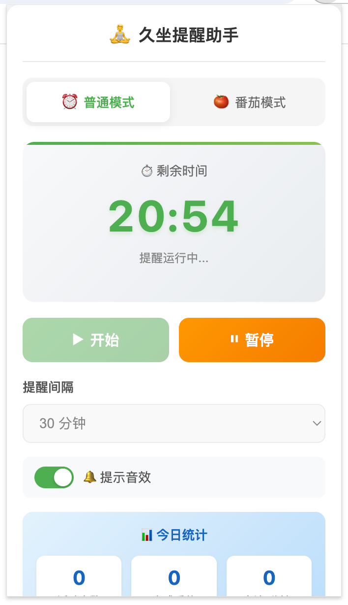
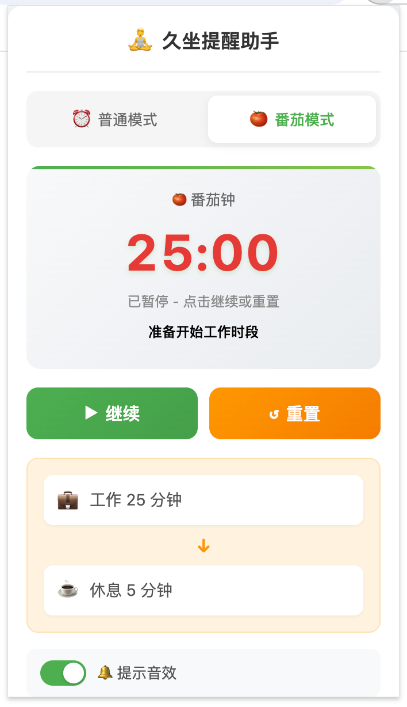
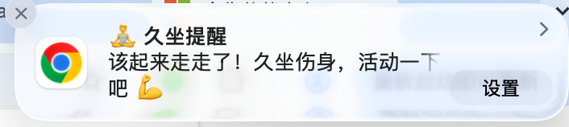

# 🧘 久坐提醒助手

<p align="center">
  
</p>

<p align="center">
  <b>定时提醒你不要久坐，起来活动活动身体</b>
</p>

<p align="center">
  <a href="#功能特点">功能特点</a> •
  <a href="#安装方法">安装方法</a> •
  <a href="#使用方法">使用方法</a> •
  <a href="#更新日志">更新日志</a>
</p>

<p align="center">
  
  
  
</p>

---

> 🎯 **开发方式**: 本项目采用 **Spec Coding** 方式开发，由 Kimi AI 根据需求规格说明自动生成完整代码。

---

## ✨ 功能特点

### 🔔 定时提醒
- 每隔一段时间弹出系统通知，提醒您起身活动
- 支持 30/45/60/90/120 分钟多种间隔选择

### 🍅 番茄工作法
- **工作时段**：25 分钟专注工作
- **休息时段**：5 分钟放松活动
- 自动循环切换，提升工作效率

### 📊 活动统计
- 记录今日活动次数
- 统计完成番茄数
- 计算今日专注时长

### 🔊 提示音效
- 开始工作时播放清脆提示音
- 休息提醒时播放柔和音效
- 可手动开关音效

### 🎛️ 其他功能
- 一键开始/暂停/重置提醒
- 普通模式/番茄模式自由切换
- 所有数据本地存储，保护隐私

---

## 📦 安装方法

### 方式一：Chrome Web Store（推荐）

> 🚧 正在审核中，即将上线...

### 方式二：开发者模式安装

1. **下载插件**
   ```bash
   git clone https://github.com/yourusername/sedentary-reminder.git
   cd sedentary-reminder
   ```

2. **打开 Chrome 扩展管理页面**
   - 在地址栏输入 `chrome://extensions/`
   - 或者点击菜单 → 更多工具 → 扩展程序

3. **开启开发者模式**
   - 右上角开启「开发者模式」开关

4. **加载插件**
   - 点击「加载已解压的扩展程序」
   - 选择 `sedentary-reminder` 文件夹

5. **完成安装**
   - 插件图标会出现在浏览器右上角工具栏

---

## 🚀 使用方法

### 普通模式

1. 点击插件图标，选择「普通模式」
2. 设置提醒间隔（建议 60 分钟）
3. 点击「开始」启动提醒
4. 时间到达时弹出系统通知
5. 完成活动后点击「✓ 已完成活动」

### 番茄模式

1. 点击插件图标，选择「番茄模式」
2. 点击「开始」启动番茄钟
3. **工作 25 分钟**：保持专注，提高效率
4. **休息 5 分钟**：起来活动，放松身心
5. 自动循环，重复步骤 3-4

### 操作说明

| 操作 | 说明 |
|------|------|
| **开始** | 启动计时器，开始倒计时 |
| **暂停** | 暂停倒计时，保留当前剩余时间 |
| **继续** | 暂停状态下恢复倒计时 |
| **重置** | 停止计时，恢复初始设置时间 |

### 查看统计

在插件界面下方查看今日统计：
- 📈 **活动次数**：普通模式提醒完成次数
- 🍅 **完成番茄**：番茄模式完成的工作时段数
- ⏱️ **专注时长**：今日累计专注工作分钟数

---

## 🖼️ 界面预览

### 普通模式
<p align="center">
  
</p>

### 番茄模式
<p align="center">
  
</p>

### 通知提醒
<p align="center">
  
</p>

---

## 🛠️ 技术架构

```
┌─────────────────────────────────────────────────────────────┐
│                    Chrome Extension                          │
├─────────────────────────────────────────────────────────────┤
│  ┌─────────────┐  ┌─────────────┐  ┌─────────────────────┐  │
│  │   Popup     │  │  Background │  │    Offscreen        │  │
│  │   (UI)      │  │  (Service   │  │    (Audio)          │  │
│  │             │  │   Worker)   │  │                     │  │
│  │ - 倒计时    │  │ - 计时核心   │  │ - 音效播放          │  │
│  │ - 模式切换  │  │ - 闹钟管理   │  │                     │  │
│  │ - 统计展示  │  │ - 通知触发   │  │                     │  │
│  └─────────────┘  └─────────────┘  └─────────────────────┘  │
└─────────────────────────────────────────────────────────────┘
```

### 技术栈

- **Manifest V3**：Chrome 最新插件标准
- **Chrome Alarms API**：精准定时，后台运行
- **Chrome Offscreen API**：离屏文档播放音效
- **Chrome Storage API**：本地数据持久化
- **Service Worker**：按需唤醒，节省资源

---

## 📂 项目结构

```
sedentary-reminder/
├── manifest.json          # 插件配置清单
├── background.js          # Service Worker - 核心计时逻辑
├── popup.html             # 弹出窗口 HTML
├── popup.js               # 弹出窗口交互逻辑
├── popup.css              # 弹出窗口样式
├── offscreen.html         # 离屏文档 - 音效播放
├── notification.wav       # 提醒音效
├── ding.wav               # 开始音效
├── icons/                 # 图标资源
│   ├── icon16.png
│   ├── icon32.png
│   ├── icon48.png
│   └── icon128.png
├── README.md              # 项目说明
├── LICENSE                # MIT 许可证
└── .gitignore             # Git 忽略配置
```

---

## 🤝 贡献指南

欢迎提交 Issue 和 Pull Request！

1. Fork 本仓库
2. 创建你的特性分支 (`git checkout -b feature/AmazingFeature`)
3. 提交你的修改 (`git commit -m 'Add some AmazingFeature'`)
4. 推送到分支 (`git push origin feature/AmazingFeature`)
5. 打开一个 Pull Request

---

## 📋 更新日志

### v2.0.0 (2024-03-28)
- ✨ 新增番茄工作法模式
- 📊 新增活动统计功能
- 🔊 新增提示音效
- 🎛️ 新增音效开关
- 🔄 优化暂停/重置交互逻辑
- 🔔 添加模式切换提示

### v1.0.0 (2024-03-28)
- ✨ 首次发布
- ⏰ 基础定时提醒功能
- 🎛️ 多间隔时间选择
- ▶️ 开始/暂停控制

---

## 📄 许可证

本项目采用 [MIT](LICENSE) 许可证开源。

---

<p align="center">
  💪 健康工作，从定时活动开始！<br>
  🍅 高效工作，从番茄钟开始！
</p>

<p align="center">
  Made with ❤️ for healthier work habits
</p>

---

## 🙏 致谢

本项目由 **[Kimi](https://kimi.moonshot.cn)** 协助开发完成。

> 💡 **Spec Coding**: 本项目采用 AI 辅助编程方式开发，通过需求规格说明驱动代码生成，展示了人工智能在软件开发中的实际应用能力。

---

<p align="center">
  <sub>Built with <a href="https://kimi.moonshot.cn">Kimi</a> • Spec Coding 🚀</sub>
</p>
